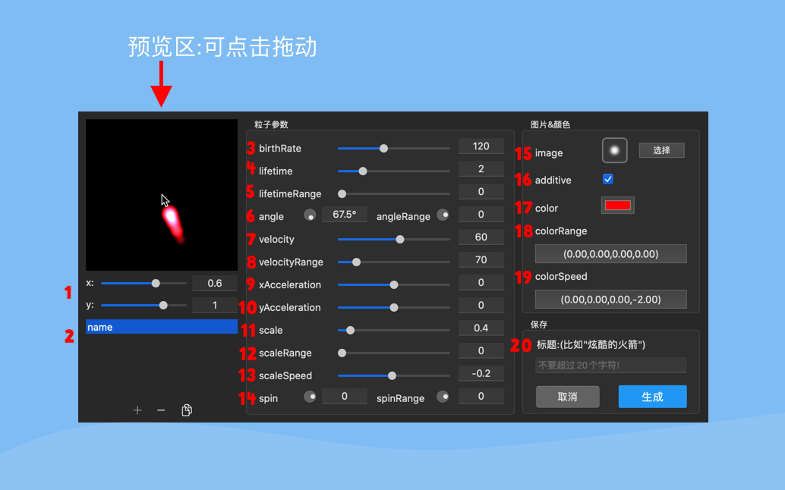

 ## 粒子参数说明   
 
   

* 1.x,y:粒子效果相对于鼠标的偏移    
* 2.name:粒子效果的名子,可添加多个粒子效果,添加、删除、复制,名子不可重复!   
* 3.birthRate:粒子产生率,每秒产生的粒子数   
* 4.lifetime:生命周期,以秒为单位   
* 5.lifetimeRange:生命周期随机性,随着范围值的正负一半而变化。   
* 6.angle:角度   angleRange:角度随机性   
* 7.velocity:速度,粒子的初始速度   
* 8.velocityRange:速度随机性,随着范围值的正负一半而变化。      
* 9.xAcceleration:x加速度   
* 10.yAcceleration:y加速度   
* 11.scale:缩放   
* 12.scaleRange:缩放随机性,随着范围值的正负一半而变化。      
* 13.scaleSpeed:缩放速度   
* 14.spin:旋转(自转)   spinRange:旋转随机性,随着范围值的正负一半而变化。      
* 15.image:图片,可点击选择内置样本图片   
* 16.additive:颜色的加法混合   
* 17.color:颜色   
* 18.colorRange:颜色随机性,随着范围值的正负一半而变化。      
* 19.colorSpeed:颜色速度   
* 20.写入标题,点击生成,会保存到iCloud   
