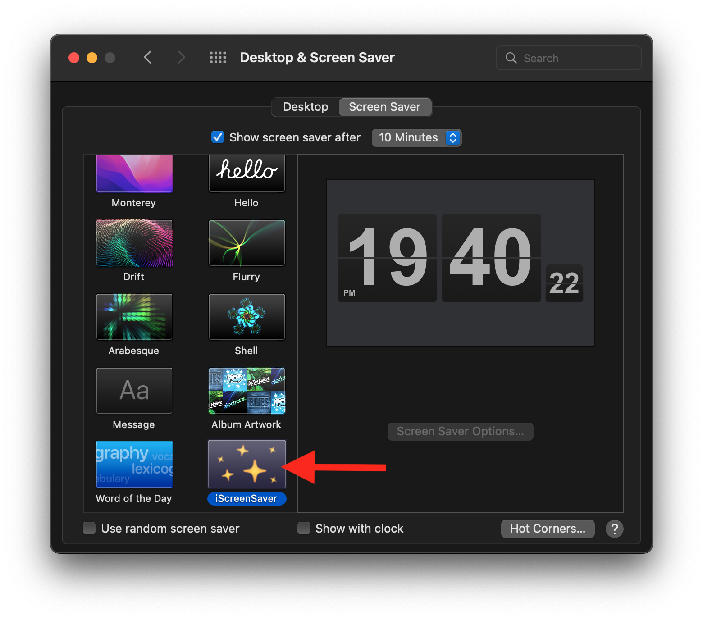

## iScreenSaver

To use native mode, a native screensaver needs to be installed into your macOS.

The following are the specific operation steps

1.[Click this line of text to download the screen saver zip](https://macosgame.com/iscreensaver/iscreensaverplugin.zip)

2.Double-click the "iscreensaverplugin.zip" compressed package to decompress it, then double-click the decompressed iscreensaverplugin.saver, and install it according to the prompts (you only need to install it once)

3.Select "iScreenSaver" in the System Setting - Screen Saver

