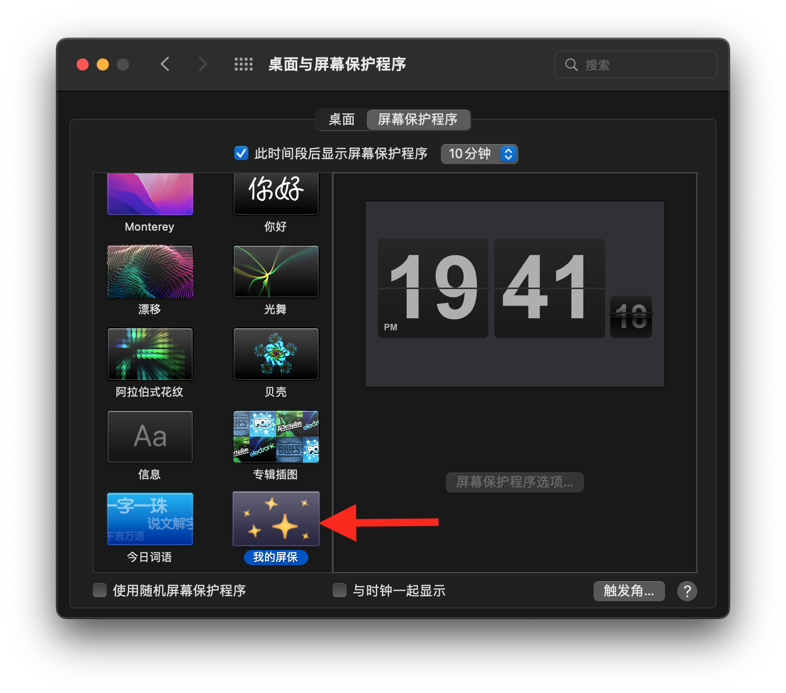

## 我的屏保

若要使用原生模式,需要将原生屏幕保护程序安装入您的macOS

以下为具体操作步骤

1,[点击这行文字下载屏幕保护程序压缩包](https://macosgame.com/iscreensaver/iscreensaverplugin.zip)

2,双击"iscreensaverplugin.zip"压缩包进行解压缩,然后对解压缩出的iscreensaverplugin.saver进行双击,按提示安装(只需安装一次)

3,在系统中选择"我的屏保"

