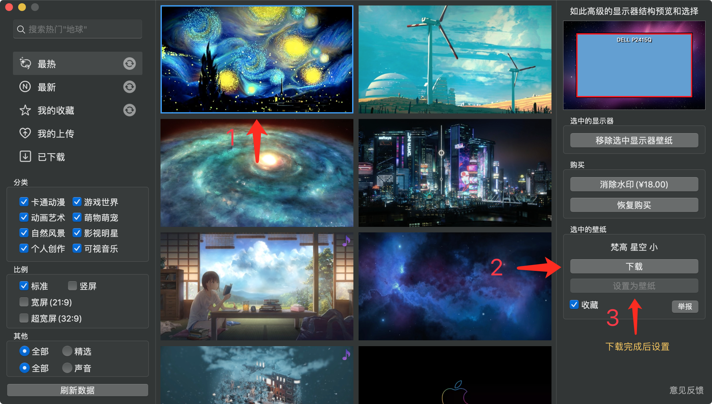
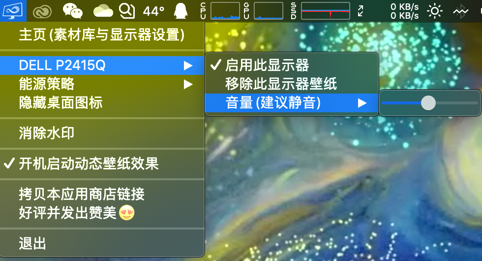
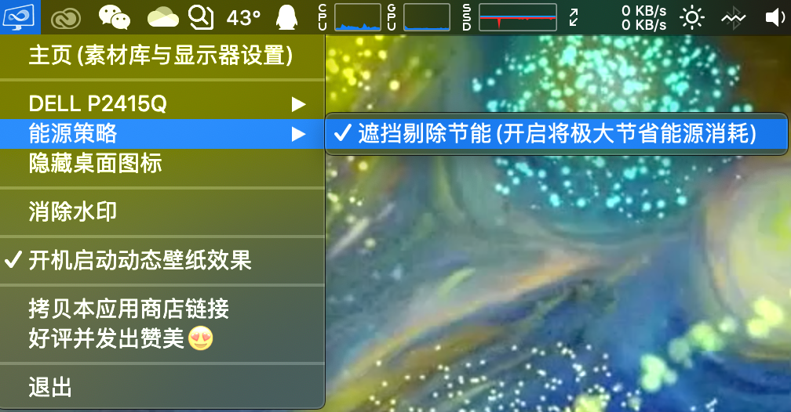
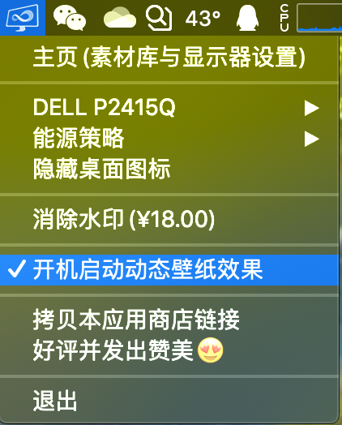

### 动态壁纸帮助

  
1. 如何设置壁纸?

  打开主页,挑选您喜欢的壁纸,点击壁纸,右侧边栏点下载,等壁纸下载完成,设置为壁纸.  
  
  
  

  
2. 怎样消除水印?

  
 消除水印需要购买,主页右侧边栏,如果您还没有购买请点消除水印,如果已经购买可恢复购买,购买后水印会消失!
 
  
  

  
3. 壁纸没有声音?

  
 有些壁纸是有声音的,可在菜单栏里设置音量!
 
     
  

  
4. 省电模式==能源策略

  
  1.0.4之前的老版本(包括1.0.4)默认开启,1.0.5(包括1.0.5)默认不开启.
  开启后: 会在屏幕大部分被遮挡的情况下暂停,如果是MacBook,还有低电量节能,默认是低于5%暂停. 
 
    
  

  
5. 开机自动启动

  
  如果希望应用在开机时自动启动请在菜单中勾选.
 
    
 

以上问题及截图,在不同的版本中效果不一样,实际以商店最新版本为准!

因为我们在用户的反馈下,不断的更新项目,为了使我们的产品变的更好!

所以,如果您有任何问题,请与我们联系!!!

E-mail: <360511404@qq.com>
