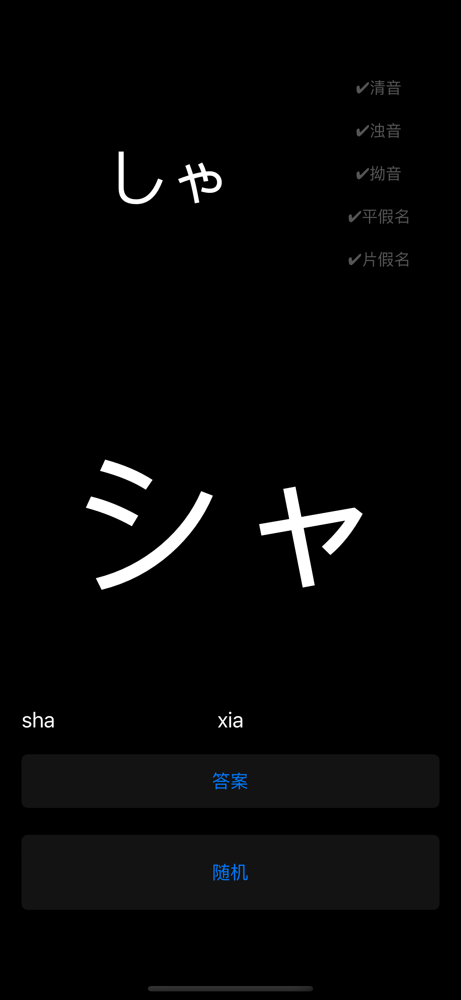

## 学渣的五十音

 为了更快速的学习日语50音及其所有衍生读音(清音,浊音,拗音),我开发了这个应用.
 
 应用的特点就是轻量,快速,纯粹,秒开秒关无联网,方便在任何时间和地点利用每一秒钟来熟悉假名.
 
 纯黑色的背景,有助于节省电量.
 
 应用的功能是通过点击按钮来随机假名,自行判断读音,再点击答案检查是否正确,直到每次都能快速反应,再也不需要点击答案为止.
 
 可以单独选择训练某一类读音.
 
 此应用永久完全免费且无内购,无广告,只为帮助学习.

